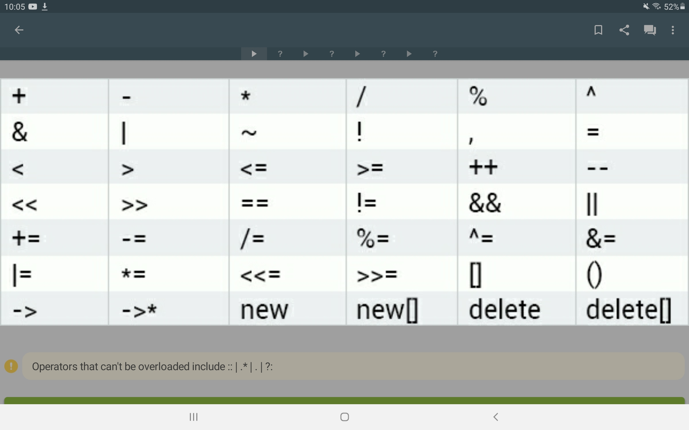
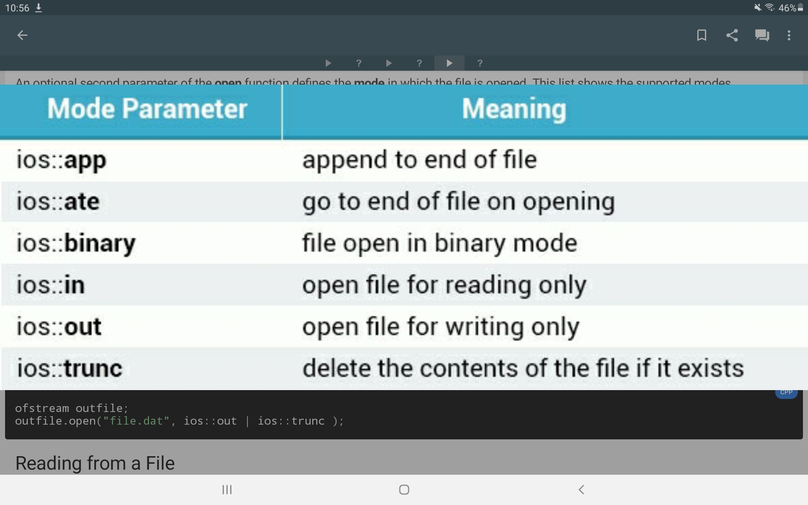

# C++

- [Usage](#usage)
- [References](#references)
- [Overview](#overview)
- [Pointers](#pointers)
- [Exceptions](#exceptions)
- [Classes](#classes)
  - [This](#this)
  - [Member Initializers](#member-initializers)
  - [Friend Functions](#friend-functions)
  - [Operator Overloading](#operator-overloading)
  - [Inheritance](#inheritance)
  - [Polymorphism and Virtual Functions](#polymorphism-and-virtual-functions)
  - [Templates and Generics](#templates-and-generics)
- [Files](#files)

## Usage

- scripting
- low-level programming
- drivers, micro controllers (e.g. Arduino)

## References

## Overview

Main function:

```cpp
#include <iostream>
using namespace std;

int main() {
  //code
  return 0;
}
```

- operators:
  - arithmetic: `+`, `-`, `*`, `/`, `%`, `++`, `--`, `+=`, `-=`, `/=`, `*=`, `%=`
  - comparision: <, >, >=, <=, ==, !=
  - boolean: ||, &&, !
- comments: `// ...`, `/* ... */`
- control structures:
  - if, else
  - switch, case, default break
  - for(init, condition, step)
    - step can include several statements like `x++, y++`
  - while(condition)
  - do, white(condition)
  - break, continue
  - ternary operator
  ```cpp
  if (<condition>) { <code> } else { <code> }
  while (<condition>) { <code> }
  do { <code> } while (<condition>);
  for (<init>; <condition>; <step>) { <code> }
  switch (<var>) {
      case <value1>: <code> break;
      case <value2>: <code> break;
      ...
      [default: <code> break;]
  }
  ```
- data types: int, double, long, string, char, bool, ...
- for numerical data types: unsigned → only positive numbers
- names are case sensitive

```cpp
// ways of declaration
datatype name; name = value;
datatype name = value;
datatype name1, name2, ...; // declares several variables at the same time
```

Input: uses the extraction operator: `>>`

```cpp
int num;
cin >> num;
```

Output: uses the insertion operator: `<<`

```cpp
cout << "Output" << "Another Output";
cout << "Print a new line with: " << endl; // print a new line with: << endl or "\n"

int a = 0;
cout << "Number: " << a;
```

- Arrays: → random access via index

```c
<datatype> <name>[<length>];
<datatype> <name>[<length>] = { ... };
<datatype> <name>[] = { ... };
```

- Functions:
  - return type void = no returned value
  - parameters = pairs of data types and variable names, separated by comma
  - parameters can also be pointers!
  - `return` = return keyword
  - overloading: same name AND different parameter list + different return type possible

```c
//must be defined before usage
<return data type> <name>(<parameters> [= <default>]) { <code> }

//or first declare function and define it later:
<return data type> <name>(<parameters> [= <default>]); //declaration
<usage>
<return data type> <name>(<parameters> [= <default>]) { <code> } //definition
```

- `using <cstdlib>`
  - access to rand()-function → returns random int
  - srand() → set a seed with `srand(<integer>)` e.g. srand(time(0)): sets seed to number of seconds
- Array as an argument: `void printArray(int arr[], int size) { <code> }`

## Pointers

- points to address of a variable → access address via &-sign
- long hexadecimal number = memory address
- "&" = "address of ..." (ampersand operator)
- "\*" = "contents of ..." (dereference operator), alias for the variable the pointer points to
  - "new" operator: allocates memory from the heap for a specific variable (dynamic memory)
  - `sizeof(var)`: returns used memory (e.g. for arrays -> size \* data type size)

```cpp
datatype * name; //creates a pointer to a variable of a specific data type
dataTypeOfVar * name = &var; //sets the pointer to a specific variable

//if memory not needed anymore:
delete pointerVariable; //clears heap address value (but pointer still exists in stack!)
```

Pointers for arrays:

```cpp
datatype * ptr = NULL; //initialize pointer
ptr = new datatype[size]; //request memory
delete [] ptr; //delete array pointed to by p
```

Pointers as function arguments:

- passing a value: overhands a copy of the passed variables value, in-function-changes do not change the original
- passing a reference: overhands the address of the passed variable, in-function-changes also change the original

```cpp
//e.g.
//argument by value
void test(int a) { a = 2; }
int a = 1;
test(a);
cout << a; //outputs 1
//argument by reference → direct access to the variables address
void test(int *a) { *a = 2; }
int a = 1;
test(&a);
cout << a; //outputs 2
```

## Exceptions

- try-catch syntax
- throw an exception with throw-keyword followed by an integer

```cpp
try { <code> ... throw <number>; } catch(int x) { <code> }
```

## Classes

```cpp
class name {
		name(parameters) { ... } //constructor
		~name() { ... } //destructor (can’t be overloaded!)
		//content: methods and attributes
}

//access to members
name obj = new name(); obj.member(...);
//or
name *ptr = &obj; ptr->member(...);
```

- access specifiers can be written for a whole area with `<specifier>: ...`
- access specifiers:
  - public (can be seen from anywhere)
  - protected (can be seen by derived classes)
  - private (can only be seen in own class)

Implementation:

- header file (classname.h) contains declarations for classes, methods and attributes → what the class will do
- source file (classname.cpp) contains their implementation → how the class will do sth.
  - using "::"-sign = scope resolution operator
  - need to include the header file of the class: #include "classname.h"

To prevent multiple definitions: only define a the specific class, if it was not defined before

```cpp
#ifndef classname_H
#define classname_H
//code for the class classname
#endif // classname_H
```

Constants: cannot be changed

- constant objects can access constant objects and non-constants objects
- non-constant objects cannot access constant objects

```cpp
//outside a class
const datatype name = value;

//inside a class → member function
returnType name(parameters) const { code }
```

### This

This pointer -> access to own members

```cpp
name
this->name
(*this).name
```

### Member Initializers

```cpp
//e.g.
//Header File
class MyClass {
		public:
			MyClass(int a, int b);
		private:
			int var1;
			const int var2;
}

//Source File
MyClass::MyClass(int a, int b) : var1(a), var2(b) { code }
```

- member initializers allow to assign values to constants at creation (must be used for them), can be used for any datatype
- can also be used for regular variables

### Friend Functions

- includes non-member function into class → friend-keyword + declaration of the function → allows the function to access the private members of the class
- function will be defined like a regular function outside the class
- takes `class &obj` as parameter and can access the members of this object

### Operator Overloading



- Redefine an operator inside a class declaration with:

  `<classname> operator<sign for operator> (<classname> &other) { ... }`

- often needs to use this-pointer, e.g. to calculate sum of to objects (this and other)

### Inheritance

```cpp
class Parent { <code> }
class Child : access_specifier Parent { <code> }
```

- type of inheritance: (base class access specifier → derived class access specifier)
  - public: public → public, protected → protected
  - protected: public and protected → protected
  - private: public and protected → private
- base class constructor is called before derived class constructor
- derived class destructor is called before base class destructor

### Polymorphism and Virtual Functions

- derived classes can be accessed as type of the base class → pointers to an object can be set as a pointer of the base class type and access the methods of the derived class if these are declared as virtual functions in the base class (→ so derived classes override this virtual function)
- virtual functions can also be implemented in base class
- pure virtual functions are declared with: `virtual <return type> <name>(<parameters>) = 0;`
- pure virtual functions must be defined by derived classes! + base classes with pure virtual functions cannot be instantiated → is called an abstract class

### Templates and Generics

- allow to call the same function for different data types
- used class name in template must be used in function definition!
  ```cpp
  //e.g. returns the sum of any objects of the same type
  template <class T> T sum (T a, T b) { return a + b; }
  //templates can consist of different data types → returns the sum of any objects, the sum will be of the type of the first argument
  template <class A, class B> A sum (A a, B b) { return a + b; }
  ```
- templates can also be used in classes
  ```cpp
  //e.g. to create an object that holds two values
  template <class T>
  class Pair {
      private: T var1, var2;
      public: Pair (T a, T b) : var1(a), var2(b) { } T bigger();
  }
  //definition syntax
  template <class T> T Pair<T>::bigger() { <code> }
  ```
- to specialize a template class for a specific data type:
  - define the general template
  - define a second class with template `<>` and with the data type behind the classname: e.g. `class MyClass<int>`

## Files

- requires standard C++ library fstream
- libraries:
  - ofstream: output file stream
  - ifstream: input file stream
  - fstream: general file stream for input and output
- needed header files: `#include <iostream>` and `#include <fstream>`
- to test whether a file is opened use: `MyFile.is_open()`

```cpp
#include <iostream>
#include <fstream>
using namespace std;

int main() {
		ofstream MyFile;
		MyFile.open(<string with file name>[, <opening mode>]);
		MyFile << "Output\n";
		MyFile.Close();
}
```

Opening mode bitflags (can be combined with `||`):


