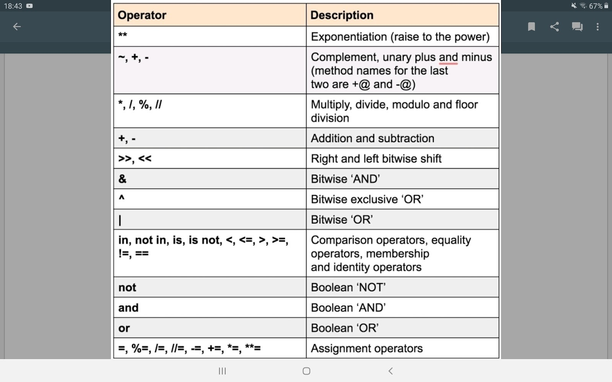

# Python

- [Usage](#usage)
- [References](#references)
- [Overview](#overview)
  - [Basic Functions](#basic-functions)
  - [Useful String Functions](#useful-string-functions)
  - [Data Types](#data-types)
    - [Regular Expressions](#regular-expressions)
      - [re.search](#research)
      - [Metacharacters](#metacharacters)
    - [Collections](#collections)
      - [Lists](#lists)
      - [Dictionaries](#dictionaries)
      - [Tuples](#tuples)
      - [Sets](#sets)
- [Functional Programming](#functional-programming)
  - [Named Functions](#named-functions)
  - [Lambdas, Anonymous Functions](#lambdas-anonymous-functions)
  - [Iterable Functions](#iterable-functions)
  - [Iterables](#iterables)
  - [Decorators](#decorators)
- [Modules](#modules)
  - [itertools-module](#itertools-module)
- [Exceptions](#exceptions)
- [Files](#files)
- [OOP/Classes](#oopclasses)
  - [Inheritance](#inheritance)
  - [Magic Methods](#magic-methods)
  - [Data Hiding](#data-hiding)
  - [Class-Methods](#class-methods)
  - [Static Methods](#static-methods)
  - [Properties](#properties)
- [Packaging](#packaging)

## Usage

- scripting
- ML tools

## References

## Overview

- operators: 
  - `==` is executed before `or`
- comments: `# ...`, `"""..."""`
- null-value: `None`
- control structures:
  - `if <condition>`, `elif <condition>`, `else`
    - if `else` is used after a loop, the `else` will be executed, if the loop was ended normally without a `break`
    - if `else` is used after a try block, the `else` will be executed, if no exception occurred
  - `while <condition>`
  - `for <var> in <iterable>`
  - ternary operator: `<val1> if <condition> else <val2>`

### Basic Functions

- `abs(<num>)`: absolute value of a number
- `input(<message>)`: input with optional message
- `len(...)`: returns the length of e.g. list, strings, ...

### Useful String Functions

| Function                      | Description                                                                                                           | Output          |
| :---------------------------- | :-------------------------------------------------------------------------------------------------------------------- | :-------------- |
| `<str>.replace(<old>, <new>)` | replaces an _old_ pattern in a _string_ with a _new_ pattern and returns the new string                               | string          |
| `<str>.startswith(<seq>)`     | returns whether a _string_ starts with a _sequence string_                                                            | boolean         |
| `<str>.endswith(<seq>)`       | returns whether a _string_ ends with a _sequence string_                                                              | boolean         |
| `<str>.upper()`               | turns a _string_ to uppercase and returns it                                                                          | string          |
| `<str>.lower()`               | turns a _string_ to lowercase and returns it                                                                          | string          |
| `<str>.split(<splitstr>)`     | splits a _string_ into several strings cutting out sequences of the _splitstring_ and returns it as a list of strings | list of strings |
| `<str>.find(<seq>)`           | returns the first starting position of a _sequence string_ in a _string_, if none is found the result is -1           | int             |
| `<str>.isalpha()`             | returns whether a _string_ only consists of letters                                                                   | boolean         |
| `<str>.isdigit()`             | returns whether a _string_ only consists of digits                                                                    | boolean         |
| `ord(<char>)`                 | returns the ASCII number of a _char_                                                                                  | int             |
| `chr(<num>)`                  | returns the char for a ASCII _number_                                                                                 | char/string     |

### Data Types

> Type conversion: `<data type>(data)` e.g. `str(...)`, `int(...)`, `float(...)`

- Boolean: `True` | `False`
- String: `"..."` | `'...'`
  - `\n` = new line
  - `\"`, `\'`, `\\` = special characters
  - `int * str` = duplication
  - `str + str` = concatenation
  - `"... {<var>} ...".format(<values>)` = formatting
    - If the vars are only numbers starting with 0 the values can be only values
    - If the vars are real variable names they have to be assigned in the brackets

#### Regular Expressions

> `import re`

- used for checking whether a string matches a pattern
- used for making substitutions in a string
- uses raw strings: `<var> = r"..."`

| Function                                           | Description                                                                                                             | Output |
| :------------------------------------------------- | :---------------------------------------------------------------------------------------------------------------------- | :----- |
| `re.match(<pattern>, <str>)`                       | beginning of _str_ must be _pattern_                                                                                    | object |
| `re.search(<pattern>, <str>)`                      | _pattern_ must be anywhere in _str_                                                                                     | object |
| `re.findall(<pattern>, <str>)`                     | returns a list of all substrings in _str_ that match _pattern_                                                          | list   |
| `re.sub(<oldpattern>, <newseq>, <str>, <count>=0)` | replaces all sequences in _str_ that match _oldpattern_ with a _newseq_ for a specific number of times (all if count=0) | string |

##### re.search

> these methods can be called on an object that was created by re.search

| Function               | Description                                                                                              | Output           |
| :--------------------- | :------------------------------------------------------------------------------------------------------- | :--------------- |
| `<obj>.group(<int>=0)` | returns the matched string, if it is 0 the whole match is returned, else only the n-th group is returned | string           |
| `<obj>.groups()`       | returns all matched groups beginning with 1                                                              | tuple of strings |
| `<obj>.start()`        | returns the start index of the matched string                                                            | int              |
| `<obj>.end()`          | returns the end index of the matched string                                                              | int              |
| `<obj>.span()`         | returns start and end index of the matched string                                                        | tuple(int, int)  |

##### Metacharacters

- Normal characters that would be metacharacters have to be escaped with `\`
- `.` = any character
- `^` = start of the string
- `$` = end of the string
- `|` = or
- `[<several characters>]` = character class -> any of the characters needs to matched
  - `[a-z]` = any small letter
  - `[A-Z]` = any capital letter
  - `[0-9]` = any number
  - `^[<several characters>]` = any character that is not in the character class
- `(<several characters or groups>)` = group
  - `{<min>=0, <max>=infinite}` = repetition of the previous expression (e.g. a group) must be between min and max
  - `*` = `{0,}`
  - `+` = `{1,}`
  - `?` = `{0,1}`
  - `?P<name><content>` = named groups, can only be accessed with `<obj>.group(<name>)`
  - `?:<content>` = non-capturing group, cannot be read with group-function, do not affect the numbering of the groups
- special sequences:
  - `<expression> \<count>` = the expression has to occur count times
  - `\d` = digits = `[0-9]`
  - `\s` = whitespace = `[ \t\n\r\f\v]`
  - `\w` = word characters = `[a-zA-Z0-9_]`
  - `\D` = no digit
  - `\S` = no whitespace
  - `\W` = no word character
  - `\A` = beginning of a string
  - `\Z` = end of a string
  - `\b` = empty string between `\w` and `\W` characters or `\w` characters at the beginning or end of a string -> represents boundary between words
  - `\B` = empty string anywhere else than `\b`

#### Collections

> Elements are always divided by `,`

Small example:

```py
someList = [1,2,4,3]
my_list.sort() # becomes [1,2,3,4]
print(someList.pop(3)) # returns and removes 4, someList is [1,2,3]
for a in someList[::-1]: print(a) # prints 3 to 1 downwards

someDictionary = {"word1": "hello", "word2": "bye"}
someTuple = (3, (2,2), [x**2 for x in range(5)], someDictionary)
set1 = {2,3,4}
set2 = {5,6,2}
print(someTuple[2][2]) # the list is [0,1,4,9,16] so 4 gets printed
print(someTuple[someTuple[0]]["word1"]) # because someTuple[0] is 3, the dictionary will be used to print "hello"
print(set1|set2) # {2,3,4,5,6}
print(set1^set2) # {3,4,5,6} because 2 is in set1 and set2
```

##### Lists

> Used, if non need for random access -> simple iterable collection, easily mutable
>
> **copy lists with `copy.deepcopy(<list>)` because otherwise you would only take the reference to the list and change the original**

```py
# creation
listVariable = [...]

# access
listVariable[ <startint>=0 : <endint>=len(<list>) : <stepint>=1 ] # inclusive startint, exclusive endint, negative numbers are counted from the end of the list
# example
listVariable[::-1] # iterates backwards over the list

# check if list contains value
if someValue in listVariable:
  # ...
```

| Function                        | Description                                                                                                         |
| :------------------------------ | :------------------------------------------------------------------------------------------------------------------ |
| `<list>.append(<value>)`        | adds _value_ to _list_                                                                                              |
| `<list>.extend(<further list>)` | adds all elements of a **further list** to another existing **list**                                                |
| `<list>.insert(<int>, <value>)` | inserts _value_ at a specific index into _list_                                                                     |
| `<list>.index(<value>)`         | returns index of a _value_ in _list_, -1 if the value is not found                                                  |
| `<list>.pop(<int>)`             | returns and removes the value with the index from the _list_                                                        |
| `<list>.remove(<int>)`          | removes the value with the index from the _list_                                                                    |
| `<list>.count(<value>)`         | returns the number of occurrences of a _value_ in a _list_                                                          |
| `<list>.sort()`                 | sorts a _list_ which consists of elements of the same type                                                          |
| `<list>.reverse()`              | changes the order of the elements of a _list_ to the opposite (this is the same like `<listvar> = <listvar>[::-1]`) |
| `range(<startint>, <endint>)`   | list of all values from inclusive start to exclusive end                                                            |
| `min(<list>)`                   | minimum of a _list_                                                                                                 |
| `max(<list>)`                   | maximum of a _list_                                                                                                 |
| `sum(<list>)`                   | sum of all values in a _list_                                                                                       |
| `all(<boollist>)`               | True if all elements are True                                                                                       |
| `any(<boollist>)`               | True if any element is True                                                                                         |

Comprehensions:

```py
<var> = [<operation> for <val> in <iterable> if <condition>] # `if <condition>` is optional
```

- `<operation>` can be any function of a lambda or a condition
- can be used to check a condition for every element in a list when using `all(...)` or `any(...)`

##### Dictionaries

> key-value relation, fast lookup, mutable

```py
# creation
dictionaryVariable = { ... }

# access
someVariable = dictionaryVariable[someKey] # reading
dictionaryVariable[someKey] = someVariable # writing
```

- each element consists of a key and a value: `<key>:<value>`
- key must be an immutable value
- if the key does not exist for `<dict>[<key>]` and a value gets assigned a new element is created, otherwise the value will be updated

| Function                                    | Description                                                                                                                                                   |
| :------------------------------------------ | :------------------------------------------------------------------------------------------------------------------------------------------------------------ |
| `<dict>.get(<key>, <not found value>=None)` | returns the value for a _key_ from a _dictionary_ - if a _not found value_ is overhanded, it will be returned if the _key_ does not exist in the _dictionary_ |

##### Tuples

> immutable -> access read only

```py
# creation
tupleVariable = ( ... ) # can be created without the brackets

# access
someVariable = tupleVariable[someIndex]
```

##### Sets

> unique elements

```py
# creation
setVariable = { ... }
# or: setVariable = set(<list>)
# set-function has to be used to create an empty set because {} is an empty dictionary
```

| Function                | Description                |
| :---------------------- | :------------------------- |
| `<set>.add(<value>)`    | adds _value_ to the _set_  |
| `<set>.remove(<value>)` | removes _value_ from _set_ |
| `<set>.pop()`           | removes random value       |

Operations:

- `set1 | set2` = returns all elements that are in set1 or set2
- `set1 & set2` = returns all elements that are in set1 and set2
- `set1 - set2` = returns all elements from set1 that are not in set2
- `set1 ^ set2` = returns all elements that are in set1 xor set2

## Functional Programming

### Named Functions

```
def <name>(<named_param>[=<standard>], *args, **kwargs):
  <code>
  [return [<val>]]
```

- Can be assigned to variables
- `*args` = parameters that are additional to the named ones
  - tuple named `args`
  - e.g.: `func(p1, *args)` called with `func(1,2,3)` -> tuple: `args = (2,3)`
- `**kwargs` = parameters that can be assigned to a name in the call for the function
  - dictionary called `kwargs` with name as key and values of the variables
  - e.g.: `func(p1, **kwargs)` called with `func(1,a=2,b=3)` -> dictionary: `kwargs = {"a": 2, "b": 3}`
- call: `<name>(<arguments for param>)` or `<var>(<arguments for param>)`
- recursion: recall of the function, needs recursion-end!

### Lambdas, Anonymous Functions

```
(lambda <param>: <code>) (<arguments for param>)
```

- functions without names
- can also be assigned to variables, than there is no argument part added!
- can only be directly called if assigned to a variable: `<var>(<arguments for param>)`

Example:

```py
myfunc = (lambda x: (x*x)%2 == 0)
print(myfunc(2)) # shows whether 2 is a divisor of the square of 2
print((lambda x,y: x**y)(3,4)) # outputs 3 to the power of 4
```

### Iterable Functions

| Function                          | Description                                                                                                                          | Output   |
| :-------------------------------- | :----------------------------------------------------------------------------------------------------------------------------------- | :------- |
| `map(<function>, <iterable>)`     | creates an iterable with all elements are created by calling a _function_ for all elements of another _iterable_                     | iterable |
| `filter(<condition>, <iterable>)` | creates an iterable with all elements out of another _iterable_ that fit a specific _condition_, this can be realised using a lambda | iterable |

Example:

```py
print(list(map((lambda x: x**2), [1,2,3,4,5]))) # [1,4,9,16,25]
print(list(filter((lambda x: x%2 == 0), [1,2,3,4,5]))) # [2,4]
```

### Iterables

- unpacking (often used for tuples):
  - `<var1>, ... , <varn> = <iterable of length n>` -> each variable gets a value of the iterable
  - if there is a `*<var>` it gets assigned all values that cannot be assigned to other variables because auf the length of the iterable
- Generators
  - cannot be indexed
  - function can be infinite
  - each next element is returned by yield keyword
  - can be converted to lists: `<list> = list(<generatorfunction>(<arguments>))`

Example:

```py
def gen_squares(x):
	for a in range(x):
    	yield a**2
li = [num for num in gen_squares(5)]
x, y, *z = li
print(z) # [4,9,16]
for num in gen_squares(2): print(num) # prints first 0 and than 1
```

### Decorators

- way to modify functions: `<decorator that calls func>(<function func>)`
- can also be done by assigning this new function to a variable
- a function can get a decorator by writing `@<decorator>` in front of the definiton

## Modules

```
import <module> [as <name>]
from <module> import <function> [as <name>]
```

### itertools-module

| Function                             | Description                                                                                   | Output   |
| :----------------------------------- | :-------------------------------------------------------------------------------------------- | :------- |
| `count(<int>)`                       | counts endless up from a value                                                                | int      |
| `cycle(<iterable>)`                  | cycles through an _iterable_                                                                  | `<val>`  |
| `repeat(<val>[, <count>])`           | repeats a _value_ a specific number of times or endless                                       | `<val>`  |
| `accumulate(<iterable>)`             | returns a running total of all elements of an _iterable_                                      | `<val>`  |
| `takewhile(<condition>, <iterable>)` | takes elements from an _iterable_ while the _condition_ is True, can be realised with lambdas | `<val>`  |
| `chain(<several iterables>)`         | combines _several iterables_ to one                                                           | iterable |
| `product(<several iterables>)`       | creates the product of _several iterables_                                                    | iterable |
| `permutations(<iterables>)`          | creates all permutations of an _iterable_                                                     | iterable |

## Exceptions

- ImportError: an import fails
- IndexError: a list is indexed with an out-of-range number
- NameError: an unknown variable is used
- SyntaxError: the code can't be parsed properly
- TypeError: a function is called on a value of an inappropriate type
- ValueError: a function is called on a value of the correct type, but with an inappropriate value

```
try: ...
except <exception>[, <further exceptions>]: ...
finally: ...
```

- raise `<exception>[(<description>)]` = raises a new exception
- single raise keyword re-raises last exception
- `assert <condition>[<description>]` = if the condition becomes False an AssertionError gets raised

## Files

| Function                           | Description                                                                                     | Output |
| :--------------------------------- | :---------------------------------------------------------------------------------------------- | :----- |
| `<var> = open(<filename>, <mode>)` | Modes:<br/>r = read<br/>w = write<br/>a = append<br/>rb = read bytewise<br/>wb = write bytewise | file   |
| `<var> = <file>.read(<int>=-1)`    | reads a specific amount of data, all if -1 or nothing given                                     | string |
| `<var> = <file>.readlines()`       | returns list with all lines                                                                     | list   |
| `<file>.write(<content>)`          | writes _content_ to a _file_ and returns the amount written                                     | int    |
| `<file>.close()`                   | closes the _file_ to save changes                                                               |        |

## OOP/Classes

> `class <classname>: ...`

- before instantiation: `__new__`-method called
- instantiation: `__init__(self[, attributes]): ...`
- when destroyed: `__del__`-method called
- methods: `def <methodname> (self[, attributes]): ...`
- access to methods: `<classname>.<methodname>([<attr>])`

### Inheritance

`class <classname>(<superclass>): ...`

- subclass:
  - can redefine superclass-methods
  - methods that are not redefined can be used
  - access to superclass-methods: `super().<methodname>([<attr>])`

### Magic Methods

- define way to deal with special characters
- method is called for the left item
- if the left item has no such method it is called for the right one
- e.g.: `x + y = x.__add__(y)`
  - `__add__` = method for "+"
  - `__sub__` = "-"
  - `__mul__` = "\*"
  - `__truediv__` = "/"
  - `__floordiv__` = "//"
  - `__mod__` = "%"
  - `__pow__` = "\*\*"
  - `__and__` = "&"
  - `__xor__` = "^"
  - `__or__` = "|"
  - `__lt__` = "<"
  - `__le__` = "<="
  - `__eq__` = "=="
  - `__ne__` = "!="
  - `__gt__` = ">"
  - `__ge__` = ">="
- if `__ne__` not implemented: opposite of `__eq__` is returned
  - `__len__` = used for `len(<var>)`
  - `__getitem__` = used for `<var>[<int>]`
  - `__setitem__` = used for `<var>[<int>] = <value>`
  - `__delitem__` = used for deleting an item
  - `__iter__` = for iteration in loops
  - `__contains__` = for "in" conditions

### Data Hiding

- single underscore at beginning of variable/method name = weakly private -> should not be used by external code (only in theory)
- double underscore at beginning of variable/method name = strongly private -> cannot be accessed from outside the class (can be accessed with `_<classname><variablename>` (without a dot!))

### Class-Methods

```
@classmethod
def <methodname> (cls[, attr]): ...
```

- get called by a class -> do not need a `self` in the attributes but a `cls`
- `cls` = class that calls the method

### Static Methods

```
@staticmethod
def <methodname> ([<attr>]): ...
```

- similar to normal functions that belong to a class -> do not need a `self` or `cls` in the attributes

### Properties

```
@property
def <methodname like attributename> (self[, attr]): ...

@<attributename>.<setter/getter>
der <attributename>(self[, attr]): ...
```

- will be called if an attribute of the class with the same name is accessed
- purpose: can make attributes read-only
- can also be setter/getter

## Packaging

- code mostly either module or script
- if both needs to write script-code inside:
  - if `__name__=="__main__": <script code>`
- each file can act like a module -> can be imported with: `import <filename>`
- 3rd party libraries:
  - Django (supports Instagram and Disqus)
  - CherryPy, Flask (web frameworks)
  - matplotlib (create data based graphs)
  - NumPy (handle multidimensional arrays faster, mathematical operations)
  - SciPy (extension of NumPy)
  - pygame (2D games), Panda3D (3D games)
- packaging = putting modules in a standard format
  - use: setuptools and distutils
- use PyPI to create a binary distribution

Example Directory:

```
<Packagename>/
  LICENSE.txt
  README.txt
  setup.py
  <Packagename>/
    __init__.py (can be blank, but must exist)
    <files ...>
```

setup.py:

```py
from distutils.core import setup
setup(
  name='<packagename>',
  version='<version>',
  packages=[list of packages ...],
  license='MIT',
  long_description=open('README.txt').read(),
)
```
